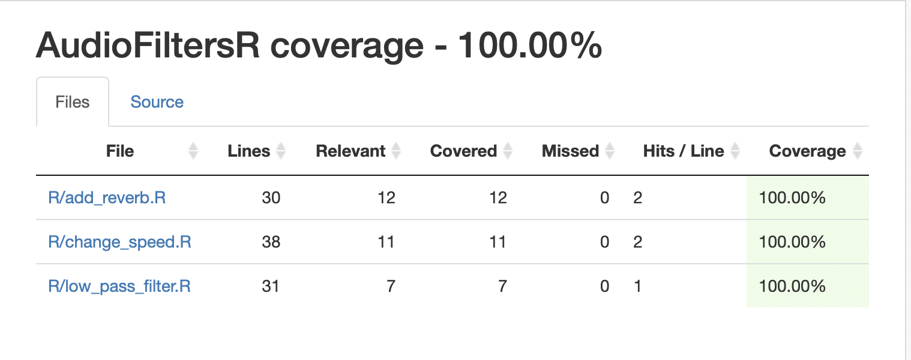

# Audio Filters R

R project for sound convolutions

### Contributors

- [Marcelle Chiriboga](https://github.com/mchiriboga)
- [Paul Vial](https://github.com/Pall-v)
- [Socorro Dominguez](https://github.com/sedv8808)


### Overview

Have you ever wondered how you could edit your audio files using filters to speed them up to save some time or maybe speed them down to listen more carefully? The purpose of this project is to create a package to address this kind of need, and it's also possible to go even deeper.

This package performs audio processing on .wav files. It contains functions which apply 1D convolutions using a simple kernel array to do some interesting transformations on the original audios, such as: changing their speed, applying effects and attenuating the signal for specified frequencies.


### Usage

All three functions expect a numeric vector as the input_signal and can be used as follows:

##### Change Speed

```
library(AudioFilters)

# Use a number greater than one to speed up the file
signal_faster <- change_speed(input_signal, 2)

# Use a number between 0 and 1 to slow down the file
signal_slower <- change_speed(input_signal, 0.5)
```

With a vector read from [input.wav](examples/input.wav) as input:

- [Result of doubling the speed](examples/output_faster.wav)

- [Result of halving the speed](examples/output_slower.wav)

##### Low Pass Filter

```
library(AudioFilters)

# Use 880 as the cutoff_frequency to attenuate all frequencies above that
signal_attenuated_above_880 <- low_pass_filter(input_signal, 880)
```

With a vector read from [input.wav](examples/input.wav) as input:

- [Result of applying low pass filter using 880 as the cuttoff frequency](examples/output_filtered_880.wav)

##### Reverb

```
library(AudioFilters)

# Use 'hall' to add a reverb effect that simulates a hall-like recording environment
hall_reverb <- add_reverb(input_signal, 'hall')

# Use 'church' to add a reverb effect that simulates a church-like recording environment
church_reverb <- add_reverb(input_signal, 'church')
```

With a vector read from [input.wav](examples/input.wav) as input:

- [Result of applying hall reverb](examples/output_reverb_hall.wav)

- [Result of applying church reverb](examples/output_reverb_church.wav)


### Installation Instructions

To install the package, follow these instructions:

1. Check if `devtools` has been installed. If not, open the console and input the following:
`install.packages("devtools")` to install devtools from CRAN.

2. The package uses `reticulate` to interact with a Python 3.7 module. This requires installing `conda`. If you don't already have `conda` installed we recommend using [Miniconda](https://conda.io/en/latest/miniconda.html#)

3. Input the following into the R console:
```
devtools::install_github("UBC-MDS/AudioFilters_R", subdir = "AudioFiltersR" ,build_vignettes = TRUE)
```


### Package Functions

###### change_speed
This function changes the audio speed, speeding up or down an audio signal.

###### add_reverb
This function applies an effect to an audio signal so that it sounds like it was recorded in a different environment.

###### low_pass_filter
This function attenuates audio frequencies above a specified cutoff level.


### Test Results


### Branch Coverage




### R Ecosystem

[Seewave](http://rug.mnhn.fr/seewave/) is an R package dedicated to sound analysis and synthesis, and includes a filter, [ffilter](http://rug.mnhn.fr/seewave/HTML/MAN/ffilter.html) with similar functionality to our high-pass filter. The functionality to be implemented by our system will also include functions for changing speed and reverb which are not found in Seewave. We do not plan to use any digital signal processing packages. We plan to code the convolutions mathematically within the functions so that they are easily testable and interpretable. We will make limited use of other packages to represent waveforms, and input/output as necessary.

[](https://travis-ci.org/UBC-MDS/AudioFilters_R)
